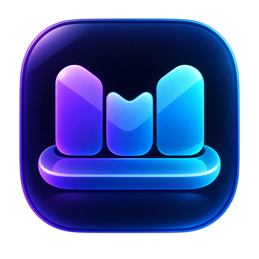

<p align="center">
  
</p>

<h1 align="center">MacDock</h1>

<p align="center">
  用 C#、WPF 和 Win32 构建的 Windows 桌面增强程序，为 Windows 带来 Dock、顶部菜单栏和可恢复的任务栏接管体验。
</p>

> [!IMPORTANT]
> MacDock 仍处于开发阶段。当前已经完成 Dock、顶部菜单栏和任务栏接管的主体功能；最小化飞入动画、启动台和完整控制中心尚未实现。涉及 Explorer 的功能全部采用安全默认值，AppBar 工作区保留目前硬关闭。

## 当前进度

MacDock 目前处于 **M2 / M3 收口阶段**，按五个规划里程碑估算整体完成度约为 60%。

| 里程碑 | 状态 | 说明 |
| --- | --- | --- |
| M1 · Dock | 已完成 | Dock 主体、鱼眼动画、项目管理、应用启动和运行状态 |
| M2 · 顶部菜单栏 | 主体完成 | 菜单栏、音量、亮度、托盘读取已实现；AppBar 仍关闭 |
| M3 · 任务栏接管 | 主体完成 | 主屏任务栏隐藏、租约、Watchdog 和异常恢复已实现 |
| M4 · 最小化飞入动画 | 未开始 | 计划使用窗口快照和贝塞尔飞行动画 |
| M5 · 启动台 / 完整控制中心 / 主题 | 未开始 | 当前仅有菜单栏音量、亮度浮窗 |

截至 2026-08-25，Release 测试基线为 **503 / 503 通过**，严格构建为 **0 warning / 0 error**。

## 已实现功能

### Dock

- 屏幕底部居中的无边框置顶 Dock，不抢占当前应用焦点，也不出现在 Alt+Tab 中。
- 独立 DWM 玻璃背景窗口，图标可以自然溢出背景上边缘。
- macOS 风格鱼眼放大、相邻图标距离衰减、悬停名称气泡和点击弹跳反馈。
- 首次运行预置资源管理器、计算器、记事本和浏览器。
- 支持拖入 `.lnk` 与 `.exe` 固定应用，支持右键移除，并保存到本地 JSON。
- 支持普通桌面程序、URI 和 Microsoft Store 应用的启动与已运行窗口激活。
- 图标后台提取、冻结和缓存；加载失败时安全降级。
- 根据可见顶层窗口实时显示运行指示圆点。
- 配置损坏或旧条目失效时执行内存自愈，不直接破坏原始文件。
- 自定义应用 Logo 已用于窗口、菜单栏、系统托盘和可执行文件。

### 顶部菜单栏

- 主显示器顶部通栏显示，提供玻璃背景和前台应用名称。
- 自动解析常见桌面程序及 UWP 应用的友好名称。
- 显示本地日期和时间。
- 使用 Core Audio 读取和调节系统音量，支持滚轮、静音和四态音量图标。
- 使用 WMI 读取和调节受支持设备的屏幕亮度；不支持时自动隐藏入口。
- 音量和亮度共用轻量浮窗，支持系统状态回灌和拖动期间的冲突保护。
- 点击 Logo 可打开“关于本机”，异步显示 CPU、内存、系统版本和主机名。
- 已实现原生托盘可见区、溢出区、Tooltip、图标更新和鼠标消息转发。

### 任务栏与恢复

- 设置中可以显式隐藏或恢复主显示器 Windows 任务栏，默认关闭。
- 通过任务栏租约记录每个受影响窗口的身份、原始状态和修改进度。
- 使用跨进程文件锁避免多个恢复者同时修改任务栏。
- 独立 `MacDock.Watchdog` 在主程序异常退出时恢复任务栏。
- 下次启动会优先处理未完成租约；恢复不可信时禁止本次启动继续修改 Shell。
- 支持 Explorer 重启后的窗口重新发现和状态协调。
- 单实例运行，避免多个 MacDock 实例竞争系统状态。

## Shell 安全状态

MacDock 会与 Explorer 和任务栏窗口交互，因此安全性优先于功能完整度。

- **AppBar 工作区保留：硬关闭。** 真机测试中，现有实现没有正确改变工作区，并造成 Explorer CPU、句柄增长和无响应。因此即使设置文件请求开启，当前版本仍只显示覆盖式顶部菜单栏。
- **托盘接管：默认关闭。** M2.3.2 已把探测移出 UI 线程，并加入 50 ms 消息超时、单飞、指数退避和失败快照；实现保留用于受控验证，目前设置窗口未开放入口。
- **任务栏隐藏：默认关闭。** 只有用户在设置中显式开启后才会执行，并由租约、启动恢复和 Watchdog 共同保护。
- 托盘读取只申请 `PROCESS_VM_READ | PROCESS_VM_OPERATION`，不申请 `PROCESS_VM_WRITE`，也不调用 `WriteProcessMemory`。
- 无法可靠识别的现代任务栏布局会直接关闭对应功能，不猜测内部结构。

## 环境要求

- Windows 11 22H2 或更高版本（主要开发和验证环境；当前目标平台为 `10.0.22621.0`）。
- [.NET 8 SDK](https://dotnet.microsoft.com/download/dotnet/8.0)。
- Visual Studio 2022 可选；仅使用命令行也可以构建和运行。

当前版本没有安装程序。Windows 10 虽保留部分兼容路径，但尚未作为完整验收目标。

## 构建与运行

在仓库根目录执行：

```powershell
dotnet restore MacDock.sln
dotnet build MacDock.sln -c Release --no-restore -warnaserror
dotnet test MacDock.Tests\MacDock.Tests.csproj -c Release --no-build --no-restore
dotnet run --project MacDock.UI\MacDock.UI.csproj
```

调试构建可以直接使用：

```powershell
dotnet run --project MacDock.UI
```

启动后会同时显示底部 Dock 和顶部菜单栏。右键系统托盘中的 MacDock 图标可以打开设置或安全退出。

## 基本使用

1. 将 `.lnk` 或 `.exe` 拖到 Dock 上即可固定。
2. 点击图标启动应用；检测到已有可见窗口时会优先尝试激活。
3. 右键 Dock 项目可以移除。
4. 点击顶部菜单栏中的音量或亮度图标打开控制浮窗，也可以直接滚动鼠标滚轮调节。
5. 在 MacDock 托盘菜单中打开设置，可配置开机自启和主屏任务栏隐藏。
6. 使用托盘菜单“退出”结束程序，以便执行完整的资源释放和任务栏恢复流程。

## 解决方案结构

```text
MacDock.sln
├── MacDock.Core/         模型、Win32 互操作、系统服务和恢复逻辑
├── MacDock.UI/           WPF 主程序、Views、ViewModels、控件、主题和资源
├── MacDock.Animations/   鱼眼、弹跳及后续飞入动画复用的动画基础设施
├── MacDock.Watchdog/     主程序异常退出后的任务栏恢复守护程序
└── MacDock.Tests/        Core 与可测试 UI 逻辑的 xUnit 测试
```

主要架构约束：

- 所有 P/Invoke 集中在 `MacDock.Core/Interop/`，按通用、托盘和音频互操作拆分。
- UI 层通过 Core 服务访问 Win32，不直接声明 `DllImport`。
- ViewModel 使用 CommunityToolkit.Mvvm；系统服务尽量通过接口和假实现进行测试。
- 关键 Win32 结构的尺寸与字段偏移由 ABI 单元测试保护。
- 后台任务必须可观察异常，并支持取消、超时或有界退出。

## 技术栈

- C# 12 / WPF / .NET 8
- CommunityToolkit.Mvvm 8.4.0
- H.NotifyIcon.Wpf 2.0.131
- NLog 6.2.0
- System.Management 8.0.0
- System.Drawing.Common 8.0.30
- Win32、Core Audio、WMI、WinRT

## 本地数据

运行时数据位于 `%AppData%\MacDock\`：

| 文件或目录 | 用途 |
| --- | --- |
| `dock-items.json` | 固定到 Dock 的项目 |
| `settings.json` | 应用设置，当前 schema 为 2 |
| `taskbar-lease.json` | 任务栏接管租约与恢复 journal |
| `taskbar-lease.lock` | 跨进程恢复互斥锁 |
| `logs\` | NLog 运行日志 |

开机自启使用当前用户的 `HKCU\Software\Microsoft\Windows\CurrentVersion\Run`，不需要管理员权限。

## 已知限制

- 顶部菜单栏当前覆盖应用窗口，不保留独立工作区。
- 托盘接管尚未在设置界面开放，第三方托盘程序兼容性仍需继续扩大真机验证。
- 隐藏 Windows 任务栏目前只处理主显示器任务栏。
- 亮度控制依赖设备提供 WMI 亮度接口，台式机外接显示器通常不会显示该功能。
- 默认音频设备切换目前使用事件回调加 5 秒低频自愈检查，尚未实现完整的设备通知回调。
- 尚无安装程序、自动更新和正式发布包。

## 后续路线

1. 收口 M2 / M3：补充托盘接管设置入口与第三方应用兼容性验证，重新设计或继续禁用 AppBar。
2. M4：实现窗口最小化到 Dock 的快照与贝塞尔飞入动画。
3. M5：在现有音量／亮度浮窗基础上实现启动台、完整控制中心和主题切换。
4. 完成功能闭环后再补安装、发布和升级流程。

## 免责声明

MacDock 是独立开发项目，与 Apple 或 Microsoft 无隶属关系。macOS、Windows 及相关名称和商标归各自权利人所有。
